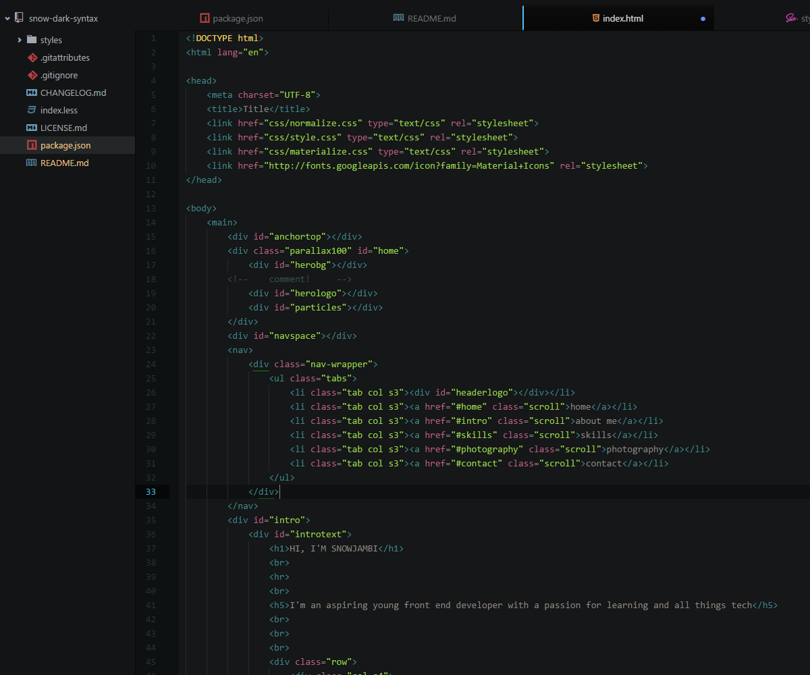
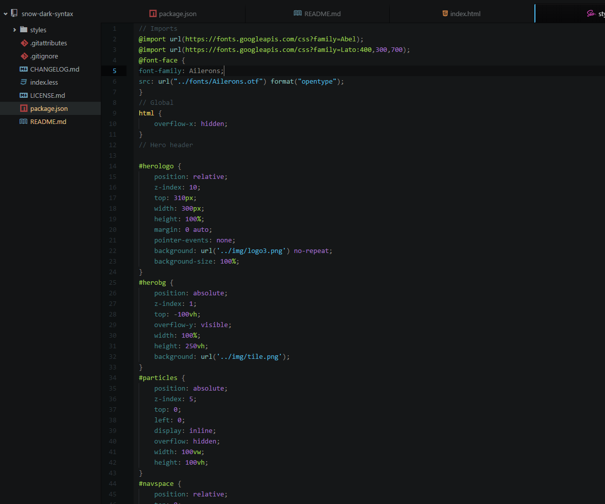

# snow-dark-syntax theme

A syntax theme for atom which is easy on the eyes, yet still colourful. This theme is intended for use with the One Dark UI theme.

Many other dark themes I tried had either over the top bright colours or excessively low contrast which wasn't too great on the eyes, so made my own. I'm learning front end development at the moment so there is a focus on HTML, CSS and Javascript. Javascript isn't finished yet and any further languages will be worked on further down the line, next is probably PHP.

I have also made a [second version](https://github.com/SnowJambi/snow-dark-material-syntax) intended for use with the Material UI theme which fixes the background for that theme.

##Installation

In a console type

```shell
apm install snow-dark-syntax
```
Or open the atom settings with ctrl+, and go to install, click themes and search for snow-dark-syntax.

##Examples

###HTML



###SCSS


